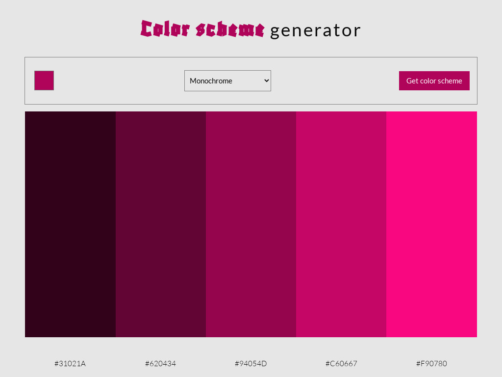

# ScrimbaSoloProject-ColorSchemeGenerator
## Table of contents

- [Overview]
  - [The challenge requirements](#the-challenge-requirements)
  - [Screenshot](#screenshot)
  - [Links](#links)
  - [Built with](#built-with)
  - [Author](#author)

### The challenge requirements

-Choose 'seed color' with an <input type="color">
-Choose clor scheme mode in a <select> box
-Send request for color scheme to API on click of button
-Display scheme colors and hex values
-Strech goal: copy hex values to clipboard on click

### Screenshot

### Links

- Live Site URL: [https://ss-color-scheme-generator.netlify.app/)

### Built with

- Semantic HTML5 markup
- Flexbox
- CSS Grid
- Mobile-first workflow
- Css
- Javascript

## Author

- Website - [https://abarisic-portfolio.netlify.app/index.html)]
- Frontend Mentor - [https://www.frontendmentor.io/profile/abarisic1509]
- Linkedin - [https://www.linkedin.com/in/ana-marija-bari%C5%A1i%C4%87-3b88b523a/]
